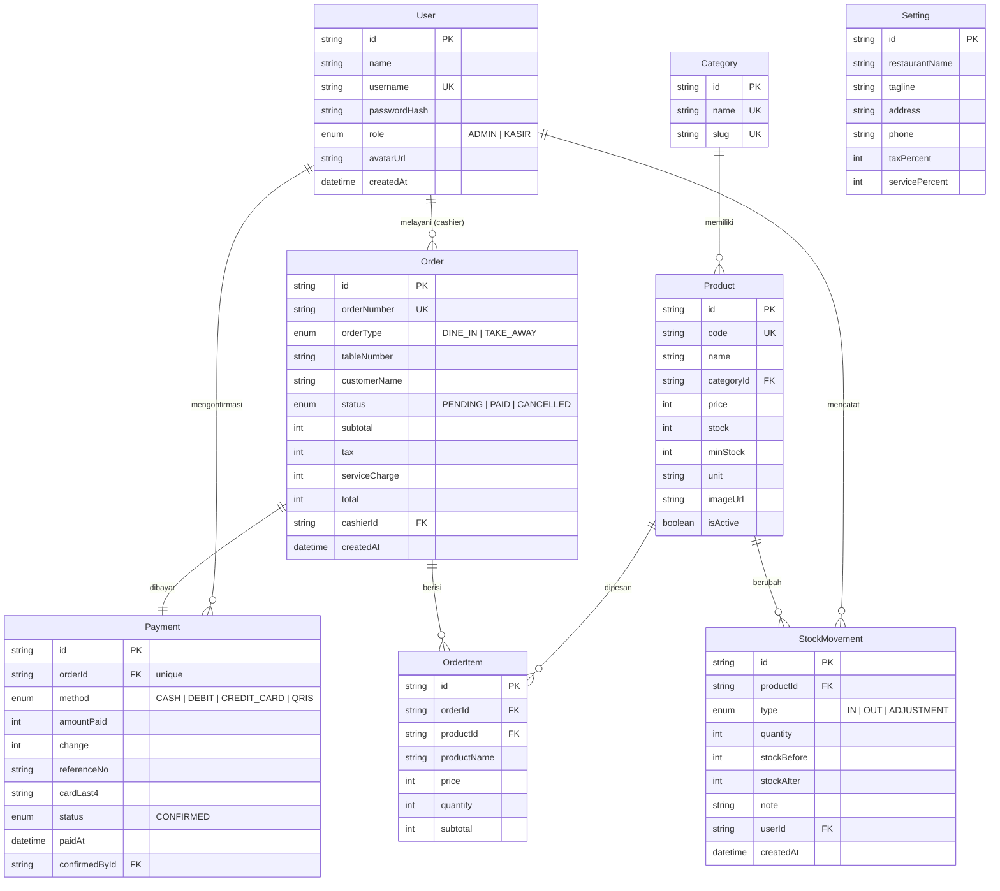
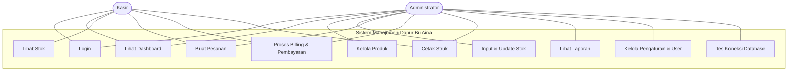
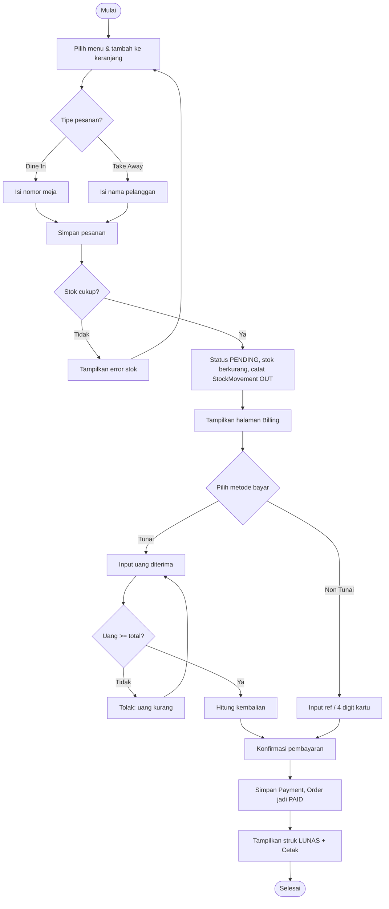
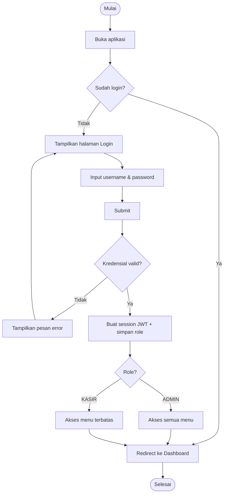
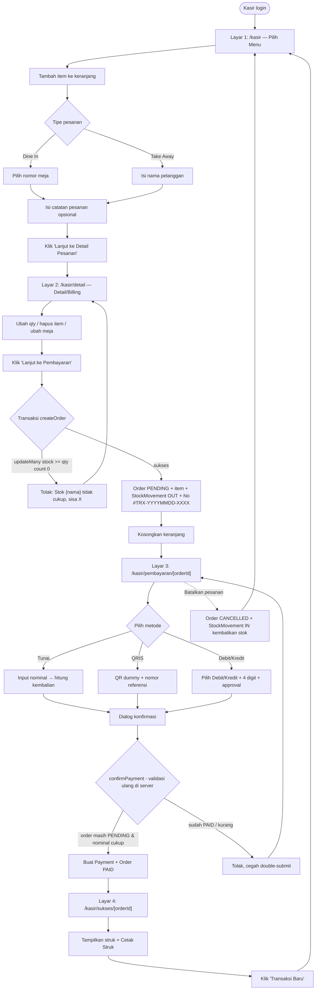
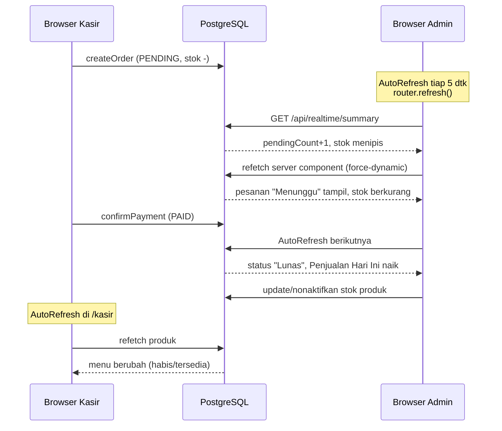
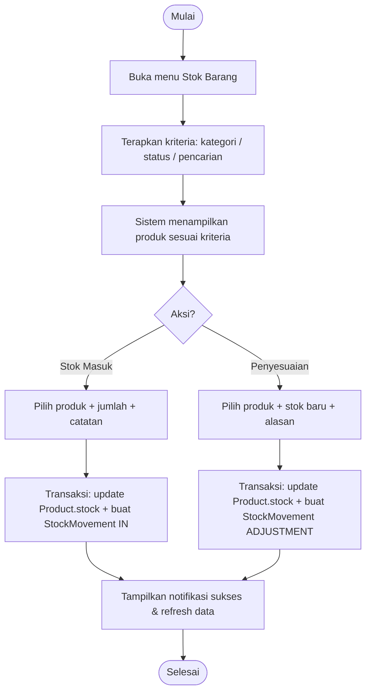

# Diagram Sistem — Dapur Bu Aina

Seluruh diagram ditulis dalam sintaks **Mermaid**. Dapat dilihat langsung di GitHub, VS Code
(ekstensi Markdown Preview Mermaid), atau https://mermaid.live.

## 1. Entity Relationship Diagram (ERD)

## 2. Use Case Diagram

## 3. Activity Diagram — Pemesanan → Billing → Pembayaran

## 4. Flowchart Login

## 5. Activity Diagram — Alur Kasir 4 Layar (POS)

## 6. Sequence Diagram — Sinkronisasi Real-time Kasir ↔ Admin

## 7. Activity Diagram — Input/Update Stok (Tugas 3a)

