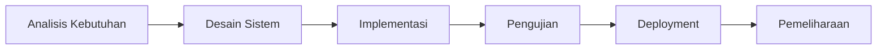

# Metode Pengembangan — Waterfall

Proyek **Dapur Bu Aina** dikembangkan menggunakan metode **Waterfall** (model air terjun),
yaitu pendekatan sekuensial di mana setiap tahap diselesaikan sebelum berlanjut ke tahap
berikutnya. Metode ini dipilih karena kebutuhan sistem sudah jelas dan terdefinisi di awal
(mengacu pada skenario Uji Kompetensi), sehingga cocok dengan alur yang terstruktur.

## 1. Analisis Kebutuhan (Requirement Analysis)
Mengumpulkan kebutuhan dari skenario restoran: pemesanan dine-in/take away, transaksi
penjualan sampai billing, pembayaran tunai & non tunai, pengelolaan stok, serta laporan
berkala. Hasil tahap ini terdokumentasi pada [`spesifikasi-program.md`](./spesifikasi-program.md)
berupa kebutuhan fungsional (F-01…F-15) dan non-fungsional (NF-01…NF-06).

## 2. Desain Sistem (System Design)
- **Desain basis data**: ERD dengan 8 entitas utama (User, Category, Product, StockMovement,
  Order, OrderItem, Payment, Setting) — lihat [`diagram.md`](./diagram.md).
- **Desain proses**: Use Case, Activity Diagram (pemesanan → billing → pembayaran), dan
  Flowchart login.
- **Desain antarmuka**: mockup UI bertema biru–navy, kartu putih rounded, sidebar + header,
  dashboard dengan grafik.
- **Arsitektur teknologi**: Next.js App Router, Prisma ORM, PostgreSQL, Auth.js.

## 3. Implementasi (Implementation / Coding)
Pengkodean dilakukan bertahap per fase:
1. Setup proyek, skema database, migrasi, seed, health check.
2. Autentikasi & proteksi route berbasis role.
3. Layout (sidebar, header) sesuai desain.
4. Dashboard dengan data real.
5. Modul Produk & Stok (**Tugas 3a**).
6. Modul Pesanan, Billing & Pembayaran (**Tugas 3b**).
7. Modul Laporan & Pengaturan.
8. Dokumentasi.

## 4. Pengujian (Testing)
Pengujian **black box** terhadap seluruh fungsi: login benar/salah, akses role, input &
update stok berdasarkan kriteria, pembuatan pesanan, validasi stok, pembayaran tunai
(kurang/pas/lebih), pembayaran non tunai, laporan, dan tes koneksi database. Rincian pada
[`pengujian.md`](./pengujian.md). Selain itu dijalankan `npm run lint` dan `npm run build`
untuk memastikan tidak ada error.

## 5. Deployment
Aplikasi di-deploy ke **Vercel** dengan database **PostgreSQL (Neon)**. Langkah lengkap
tersedia di `README.md`. Migrasi dijalankan dengan `prisma migrate deploy` dan data awal
dengan `npm run db:seed`.

## 6. Pemeliharaan (Maintenance)
Perbaikan bug dan penyesuaian kebutuhan dilakukan setelah sistem berjalan. Struktur kode
modular (folder `actions/`, `lib/`, `components/`) memudahkan pengembangan lanjutan.
